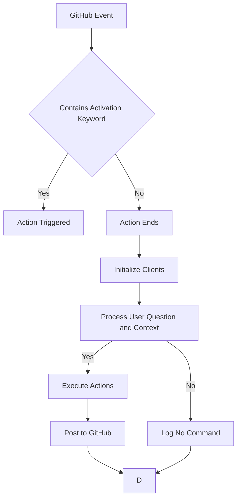

# gemini-for-github

This project provides a command-line interface (CLI) tool to interact with GitHub and the Gemini API for tasks such as code review and analysis. It leverages various clients for GitHub, Git, Filesystem operations, Generative AI (Gemini), and MCP servers to perform its functions.

## Features

- AI-powered assistance for GitHub workflows (code reviews, issue analysis, code understanding).
- Integration with GitHub events and the Gemini AI model.
- Processing of context from PR diffs or issue bodies.
- Triggering actions based on user comments and predefined commands.
- Potential for making code changes via integration with tools like Aider.

## Workflow

The following diagram illustrates the typical workflow when the `gemini-for-github` action is triggered:



## Installation

(Add installation instructions here once available, e.g., using Poetry or pip)

## Configuration

The application can be configured using a YAML file. A default configuration file is located at [`./src/gemini_for_github/config/default.yaml`](src/gemini_for_github/config/default.yaml).

Key configuration options include:

- `activation_keywords`: Keywords that trigger the application when used in a user question.
- `globally_allowed_tools`: Tools that are available to all commands.
- `mcp_servers`: Configuration for connecting to various MCP servers.
- `commands`: Definitions of available commands, including their prompts and allowed tools.
- `system_prompt`: The base prompt used for the AI model.

Environment variables can also be used for configuration, particularly for sensitive information like API keys and GitHub credentials. Refer to [`src/gemini_for_github/cli.py`](src/gemini_for_github/cli.py) for the list of supported environment variables.

## GitHub Action Usage

This action can be triggered by `issue_comment`, `pull_request`, or other events.

To use this action in another repository, add a workflow file (e.g., `.github/workflows/gemini-action.yml`):

#### Triggering via Issue Comment

```yaml
name: Gemini Action on Issue Comment

on:
  issue_comment:
    types: [created]

jobs:
  run_gemini_action:
    if: 
      contains(github.event.comment.body, '/gemini')
    runs-on: ubuntu-latest
    steps:
      - name: Checkout code
        uses: actions/checkout@v4

      - name: Run Gemini Action
        uses: strawgate/gemini-for-github@0.3 # Replace with your repo and tag/branch
        with:
          gemini_api_key: ${{ secrets.GEMINI_API_KEY }}
          github_token: ${{ secrets.GITHUB_TOKEN }}
          github_issue_number: ${{ github.event.issue.number }}
          user_question: ${{ github.event.comment.body }}
```

#### Triggering via Pull Request

```yaml
name: Gemini Action on Pull Request

on:
  pull_request:
    types: [opened, synchronize, reopened]

jobs:
  run_gemini_action:
    runs-on: ubuntu-latest
    if: 
      contains(github.event.comment.body, '/gemini') # This condition might need adjustment for PRs, e.g., based on PR body or specific labels
    steps:
      - name: Checkout code
        uses: actions/checkout@v4
      - name: Gemini via GitHub Actions
        uses: strawgate/gemini-for-github@0.3 # Check the listing for the latest version
        with:
          gemini_api_key: ${{ secrets.GEMINI_API_KEY }}
          github_token: ${{ secrets.GITHUB_TOKEN }}
          github_pr_number: ${{ github.event.pull_request.number }}
          user_question: "gemini review this pull request." # Or use a comment from the PR
```

## Contributing

(Add contributing guidelines here)

## Development

See [DEVELOPING.md](DEVELOPING.md) for information on setting up a development environment and contributing to this project.

## License

This project is licensed under the MIT License. See the [LICENSE](LICENSE) file for details.